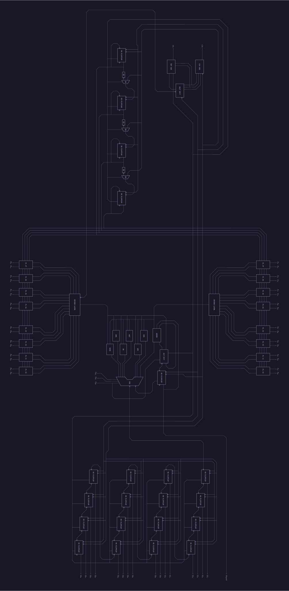

# 16-bit ALU Design and Implementation

This project implements a basic 16-bit Arithmetic Logic Unit (ALU) in Verilog that performs operations sequentially using a 1-bit ALU with 3-bit opcodes. It supports addition, subtraction, and six different logical operations. The design is entirely structural and has been verified with simulation and an interactive testing interface.

## Overview

This repository contains the Verilog implementation of a 16-bit ALU that performs operations sequentially. The design is written entirely in structural Verilog and is tested with a simple testbench. Additionally, an interactive testing tool called **alutester** (an ncurses-based TUI program) is provided for a dynamic simulation experience.

> **Note:** The documentation for the project is still a work in progress. Refer to the `docs/` directory for the current status of the project diagrams and LaTeX source files.

## Final Schematic

The final schematic of the entire ALU is provided below:



The schematic illustrates the overall interconnection of components within the ALU, as implemented in the `alu.v` file.

## Modules and Source Files

- **`alu.v`**  
  Contains the Verilog implementation of the complete 16-bit ALU. This file implements the ALU in a fully structural style.

- **`testbench.v`**  
  A testbench to simulate and verify the functionality of the ALU. It generates clock pulses, sets up inputs, and monitors the outputs.

## Specification

**Inputs:**
- **A:** 16-bit number  
- **B:** 16-bit number  
- **Clk:** Clock signal  
- **On:** Signal to start computation

**Opcodes (3-bit):**
- **ADD:** 000  
- **SUB:** 001  
- **XOR:** 010  
- **AND:** 011  
- **NOT:** 100  
- **OR:** 101  
- **NOR:** 110  
- **NAND:** 111  

**Outputs:**
- **Out:** 16-bit output from the memory unit  
- **Regout:** 1-bit output from an internal register within the ALU

## Compiling and Simulating

### Direct Simulation with Icarus Verilog

This project uses [Icarus Verilog](http://iverilog.icarus.com/) (`iverilog`) and `vvp` for simulation. The following steps outline the process:

1. **Clone the Repository:**

   ```sh
   git clone https://github.com/your_username/alu
   cd alu
